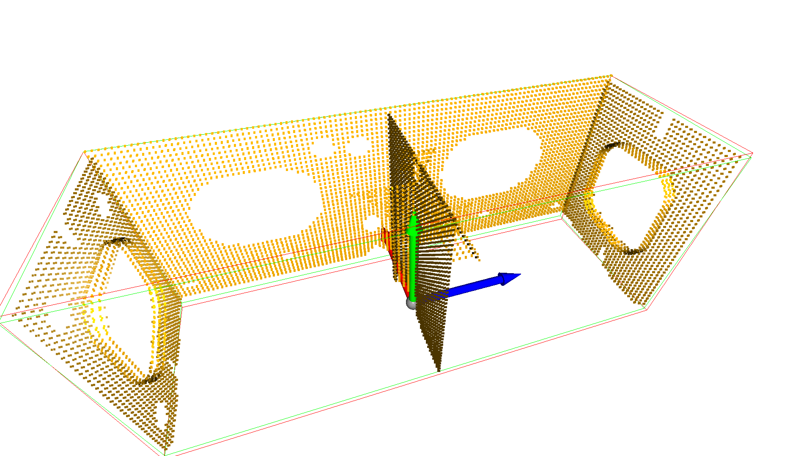
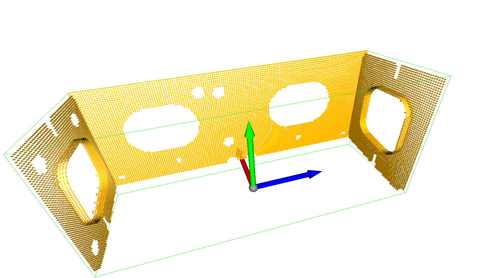

# Data

Just some sample data for testing the registration scripts.

The data folder contains:

- some examples of scans from the ROS simulator in `scans_ros`
- some examples of maquette samplings with the number of points in `maquetteXX.ply` where XX is the number of points
- some examples of partial samplings of the maquette:
  - `E_shape_maq15k.ply` in which some parts of the maquette are missing giving an E shape.
  
  - `u_shape_maqXX.ply` same but with an U shape.
  

- `sameref` contains the same point clouds but brought in common reference frame (axis flipped to match the visualizer) and scaled to mm.
